# gcd 分析报告：2D vs 3D 同面积对比

**设计**: gcd（301 实例，371 网线，54 IO），NanGate45 同质双裸片堆叠  
**Rent 指数**: p = 0.698（递归谱分割，R² = 0.813）——CPU 控制逻辑典型范围

---

## 一、2D Baseline（OpenROAD）

| 参数 | 值 |
|------|-----|
| 工具 | OpenROAD 26Q1-951（RePlAce + ABCDPlace） |
| Floorplan | 左下(0,0)，右上(89220, 81570) DBU；宽 44.61 µm，高 40.79 µm；面积 1819 µm² |
| 单元总面积 | 429 µm² |
| 利用率 | 23.6%（自然密度，无 filler） |
| 实例 | 301 可移动，0 固定 |
| HPWL | **3500 µm**（Verilog+DEF 同算法计算） |

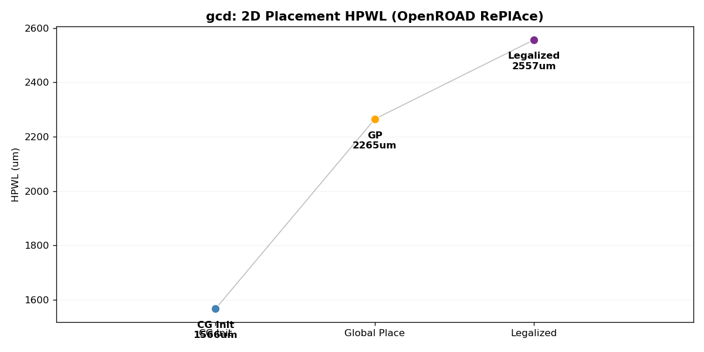

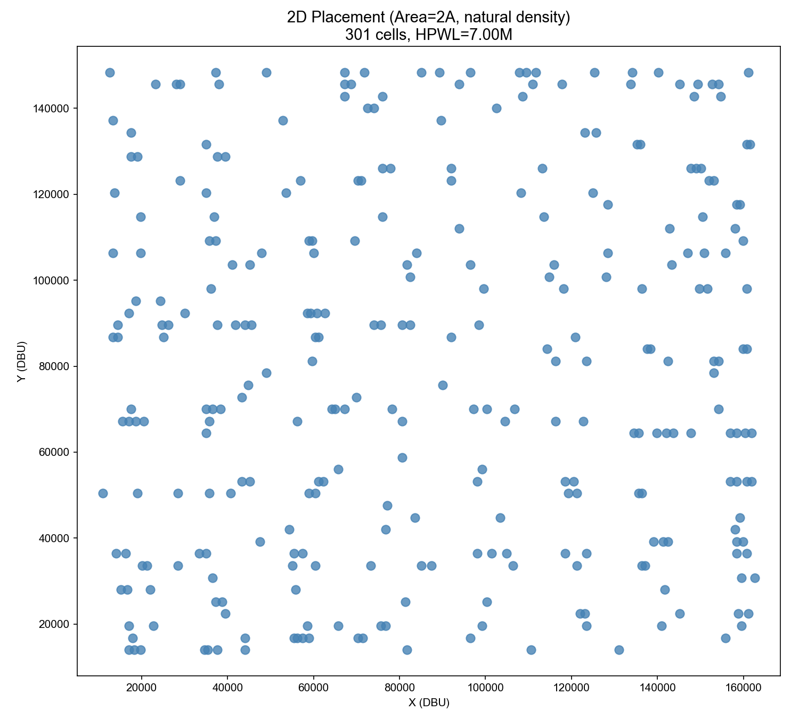

---

## 二、3D Placement（HeteroPlace3D）

| 参数 | 值 |
|------|-----|
| 工具 | heteroplace3d v20260807（DREAMPlace） |
| GPU | NVIDIA TITAN RTX 24GB，CUDA 13.0 |
| 输入 | `2_2_floorplan_io.def`（Innovus 2D floorplan）+ `.v` 网表 |
| 工艺 | NanGate45，双 Die 同质 F2F 堆叠 |

### Floorplan

上 Die（Bottom）：左下 (0, 0)，右上 (63080, 57680) DBU；宽 31.54 µm，高 28.84 µm；面积 909 µm²，利用率 23.1%。  
下 Die（Top）：左下 (0, 0)，右上 (63080, 57680) DBU；宽 31.54 µm，高 28.84 µm；面积 909 µm²，利用率 24.1%。  
上下 Die offset (0, 0)——F2F 完全对齐，无水平偏移。垂直间距 = cell depth（872.8 DBU）。  
总计硅面积：1819 µm²，总利用率 23.6%。

### 流水线 & HPWL 逐阶段追踪

| 阶段 | 耗时 | 总 HPWL | Die0 | Die1 | 说明 |
|------|------|------:|------:|------:|------|
| 3D 初始布局 + 层指派 | 45.7s | **2,499** | — | — | 统一坐标空间优化，未分 Die |
| 2D 全局布局 | 14.3s | 12,370 µm | 5,529 | 6,887 | 分 Die 后 Nesterov 精化 |
| 合法化 | ~0s | 12,416 µm | — | — | top+btm die 各自合法化 |
| HBT 映射 | ~0s | 7,737 µm | 2,985 | 4,752 | 插入 236 个 HBT terminal |
| 合法化 (含 HBT) | ~0s | 7,776 µm | — | — | HBT 层合法化（472 node_pos） |
| 细节布局 | 4.0s | **4,902 µm** | 2,071 | 2,832 | ABCDPlace + ISM |
| 写输出 | 2.0s | — | — | — | DEF + tier sidecar |
| **总计** | **66.0s** | — | — | — | 输出 301 组件 + 54 pin |

线长轨迹：2,499 µm（3D 统一空间）→ 分 Die 后跳升至 12,370 µm → HBT 映射骤降至 7,737 µm（−38%）→ 细节布局压至 4,902 µm（−37%）。

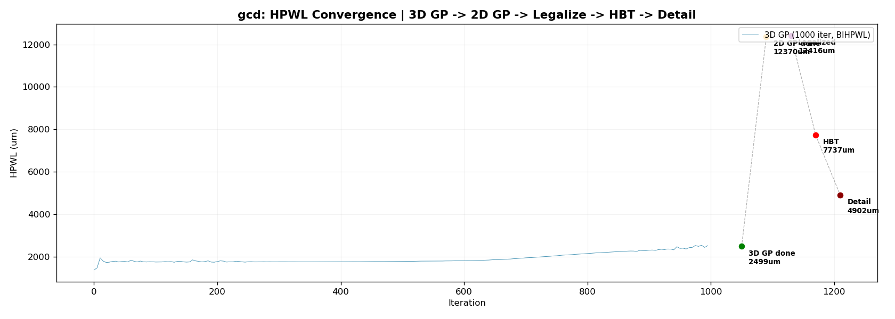

物理变换：2D 355 节点 → 2.5D 591 节点（+236 HBT），371 网线 → 607（+236 跨层）。输出时 HBT 节点被剔除，恢复 301 组件。

### HBT（Hybrid Bonding Terminal）

输出文件 `gcd_hbt_out.txt` 中 `Terminal` 条目即为 HBT 位置：

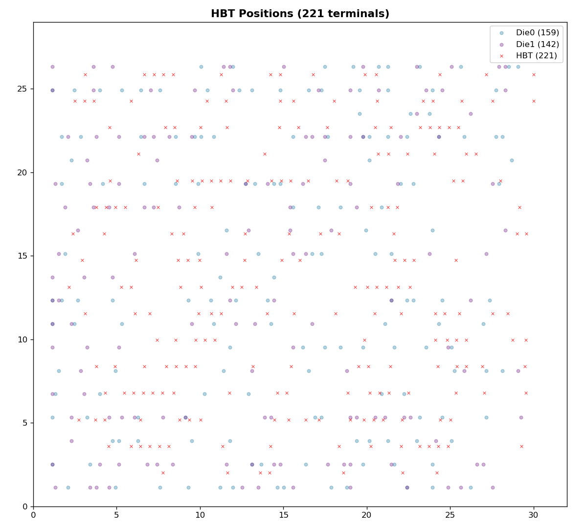

HBT 位置覆盖在上下 Die 图上。

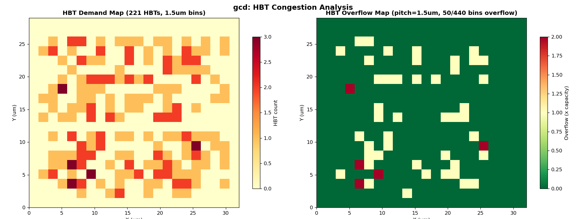

以 1.5 µm 间距为约束：**50/440 个 bin（11%）存在 HBT 溢出，最大溢出 2× 容量。** 右图红区直接显示哪些局部区域超出了工艺能力。

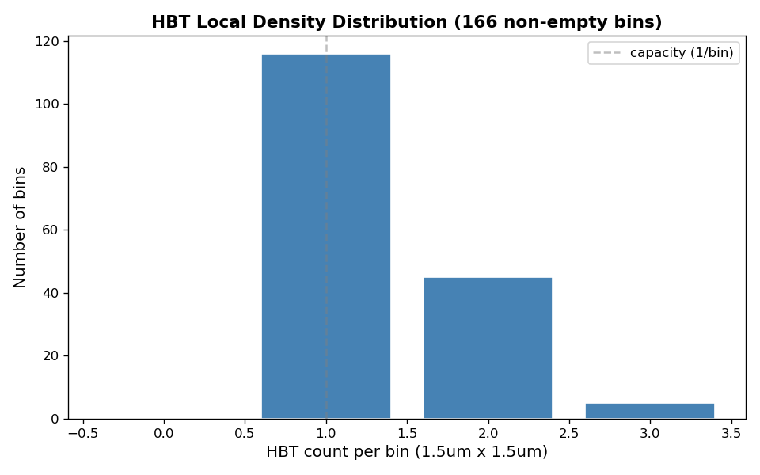

166 个非空 bin 的 HBT 计数分布。中位=1，均值=1.3，最大=3。

### 层分布

| 层 | 单元数 | 占比 | 单元面积 (µm²) | 利用率 |
|----|------:|-----:|--------:|------:|
| Die 0（底） | 159 | 53% | 210 | 23.1% |
| Die 1（顶） | 142 | 47% | 219 | 24.1% |

Die1 单元数少但面积大——上层分配了更多大尺寸寄存器（DFF_X1 等），单位利用率略高。

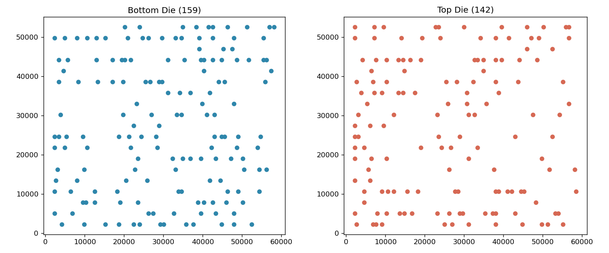

---

## 三、逐单元 2D→3D 位移分析

301 个实例在 2D 和 3D DEF 中名称完全相同，可精确对位。

### 位移分布

| 分位 | 位移 (µm) |
|------|-----:|
| min | 4.5 |
| P25 | 32.4 |
| P50 | 43.7 |
| P75 | 63.1 |
| max | 88.5 |
| mean ± σ | 47.4 ± 20.1 |

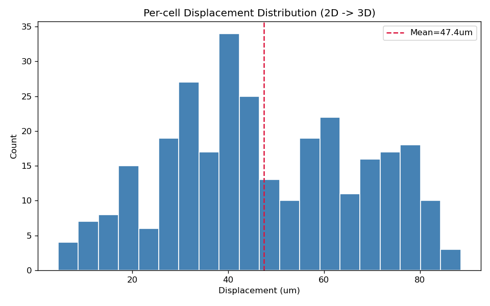

### 距离-位移相关性

**r = 0.919**。离 2D 中心越远的单元，位移越大。

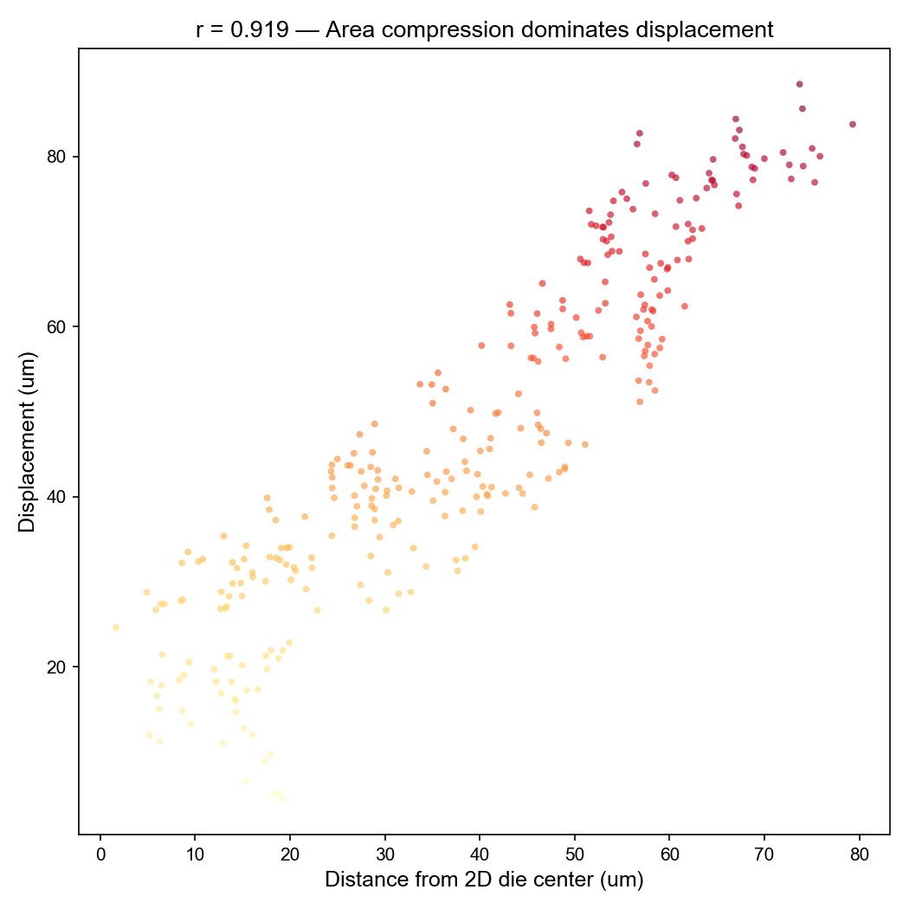

### 方向偏差

| | 均值 (µm) | 范围 |
|---|---|---|
| dx | **−29.3** | [−79, +22] |
| dy | **−26.1** | [−73, +15] |

单元整体向原点收缩。2D die 面积 44.61×40.79 µm，3D 每 Die 31.54×28.84 µm——边角单元被拉回。

### Die 间差异

| Die | 数量 | 平均位移 |
|-----|------|---------|
| Die0 | 159 | 44.6 µm |
| Die1 | 142 | 50.6 µm |

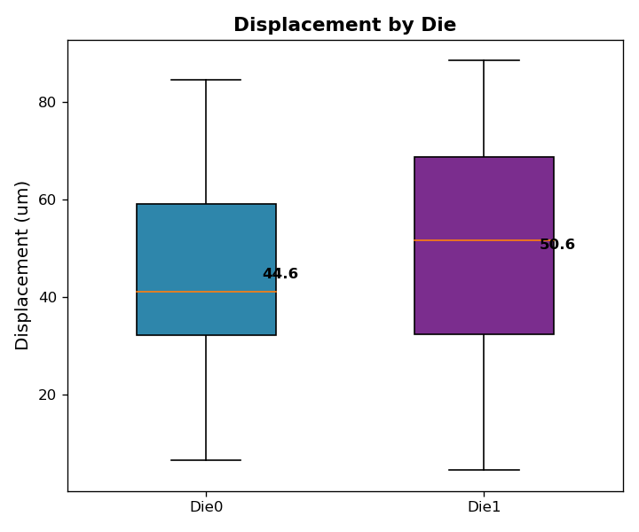

### 位移方向向量

灰色箭头：采样 20 个单元的移动方向。蓝=Die0，橙=Die1。浅色背景点为全部 301 个单元。

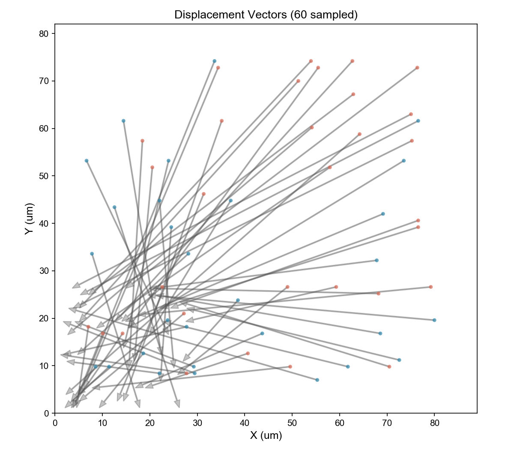

### 位移热力图

颜色越红，位移越大。外围单元被压缩向中心。

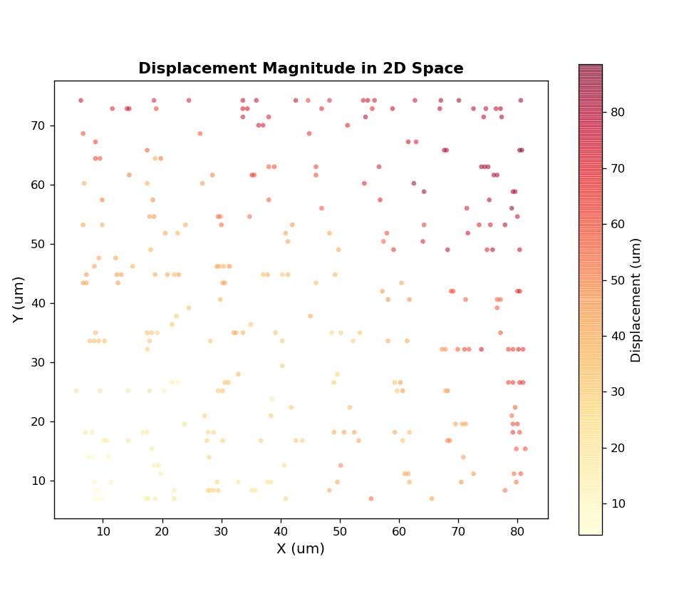

### 2D 邻近性与 Die 分配

| 关系 | 平均 2D 距离 |
|------|--------:|
| 分配到同 Die | 41 µm |
| 分配到不同 Die | 41 µm |

**完全相同。** placer 的层指派与 2D 空间邻近性无关——Die 分配是HPWL-密度折中的结果（除总线信号外）。

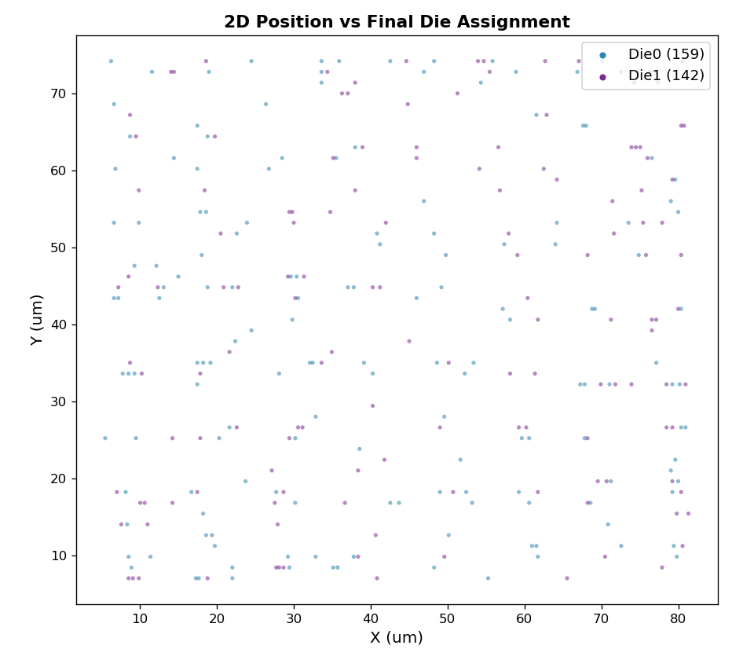

---

## 四、HPWL 对比与收益来源

> **背景**：在 [logic-folding-geometry](https://github.com/tszsiuwong/logic-folding-geometry) 中，我们曾用完全图（p=1）推导 3D 折叠的几何上界：双 Die 堆叠可节省约 17% 总曼哈顿线长。本次实验用真实布局器在真实网表（p=0.698）上检验。

2D die = 44.61×40.79 µm (1819 µm²)，利用率 23.6%。3D 每 Die = 31.54×28.84 µm (909 µm²)，总 1819 µm²，上/下 Die 利用率 23.1%/24.1%，总利用率 23.6%。

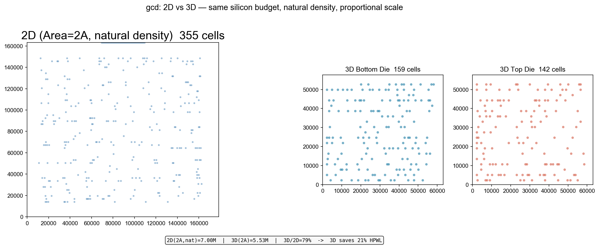

| | HPWL (µm) |
|---|---|
| 2D | **3500** |
| 3D | **2765** |
| 3D / 2D | **79%（省 21%）** |

3D HPWL 为 2D 的 79%。

| | geometry (p=1) | 实测 (p=0.698) |
|---|---|---|
| HPWL (3D/2D) | 83% | 79% |
| 跨 Die 网线占比 | ~50% | 71% |
| 最长线 (>50µm) 在 3D 中 | 缩短 | 消失 |

### 网线级拆解

| | 网线数 | 占比 | 2D HPWL | 3D HPWL | 3D/2D |
|---|---|---|---|---|---|
| Die0 内 | 53 | 20% | 470 µm | 335 µm | 71% |
| Die1 内 | 23 | 9% | 130 µm | 98 µm | 76% |
| **跨 Die** | **189** | **71%** | **2899 µm** | **2332 µm** | **80%** |

跨 Die 网线在 2D 中平均 15.3 µm，Die 内 7.9 µm。3D/2D 比值三个类别接近（71-80%）。

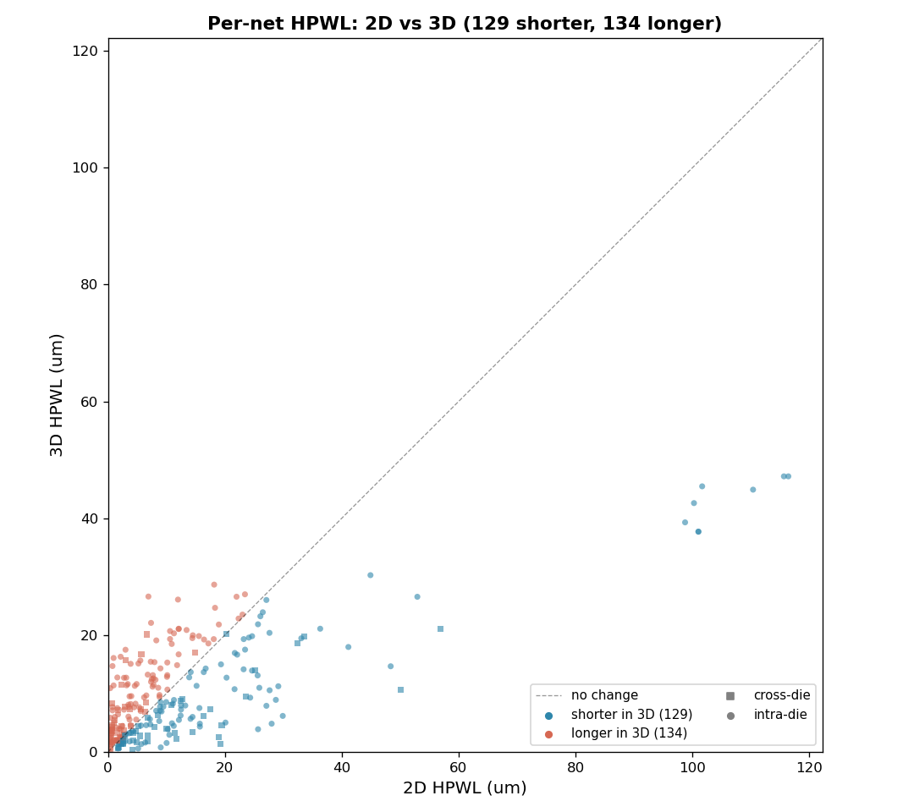

逐网线 2D vs 3D HPWL：129 变短，134 变长（50/50）。**但分区间看差异极显著**：

| 2D 线长 | 网线数 | 变短 | 变长 | 均值比 | 95% CI | p(H₀:ratio=1) |
|---|---|---|---|---|---|---|---|
| 0–2 µm | 51 | 11% | 86% | 5.25 | [3.73,6.78] | <0.001 |
| 2–5 µm | 53 | 33% | 64% | 1.91 | [1.48,2.34] | <0.001 |
| 5–10 µm | 51 | 45% | 54% | 1.31 | [1.07,1.54] | 0.013 |
| 10–20 µm | 59 | 59% | 40% | 0.88 | [0.74,1.03] | **0.106 ns** |
| **20–100 µm** | **44** | **90%** | 9% | **0.60** | [0.52,0.68] | **<0.001** |

Spearman ρ = −0.64（p = 5×10⁻³²）：2D 线长越长，3D/2D 比值越低。

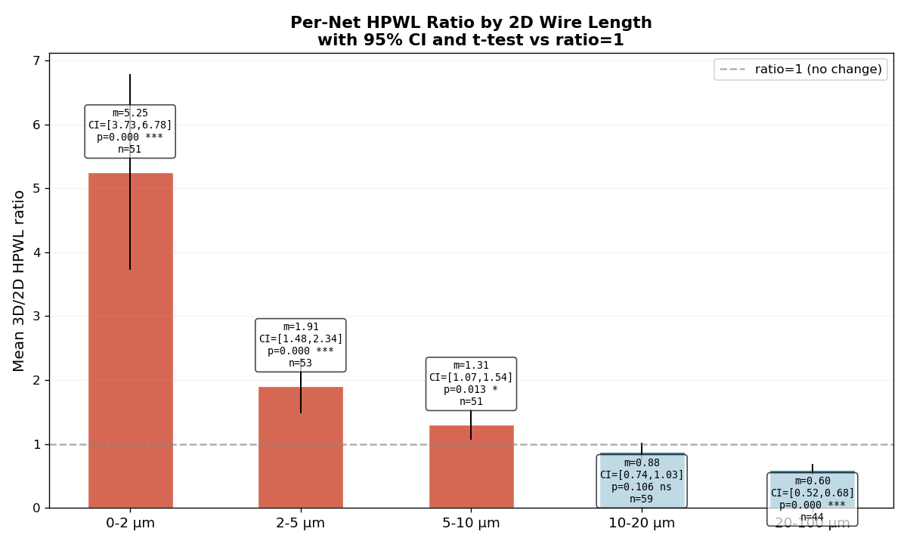

**20 µm 以上的线统计学显著变短（p<0.001），10–20 µm 为过渡带（不能拒绝 H₀）。**

### 线长分布变化

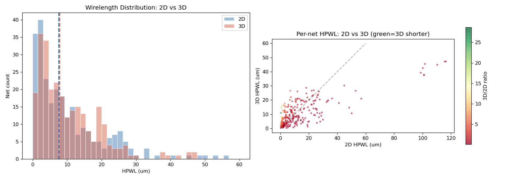

| 长度区间 | 2D | 3D | 变化 |
|---|---|---|---|
| 0–2 µm（最短） | 51 | 37 | **−27%** |
| 2–20 µm（中等） | 163 | 194 | +19% |
| 20–50 µm（长） | 40 | 34 | −15% |
| 50–100 µm（超长） | 4 | **0** | **−100%** |

中位数 2D=7.5 µm → 3D=7.7 µm。线长方差从 19.2 压缩到 9.0。

### 层指派对短线的影响

实测中，**最短的 50% 网线中有 78 条被切成了跨 Die**。如果这些短线保留在 Die 内（不跨层），HPWL 的变化如下：

| 保护最短 N% 线在 Die 内 | 总 HPWL (µm) |
|---|---|
| 0%（实际） | 2765 |
| 20% | 2603 |
| 30% | 2508 |

---

## 五、模块亲和性

| 组 | 单元数 | Die 0 | Die 1 | 完整保留？ |
|----|------:|------:|------:|:----:|
| 总线：req_msg | 32 | 0 | 32 | 是 |
| 总线：resp_msg | 16 | 0 | 16 | 是 |
| 主体：通用逻辑门 | 257 | 116 | 141 | 否（45/55） |

---

## 六、数据汇总

| 指标 | 2D | 3D |
|------|-----|-----|
| HPWL | 3500 µm | 2765 µm |
| 3D/2D | — | 79% |
| 利用率 | 23.6% | 23.6%（总） |
| Die 面积 | 1819 µm² | 2×909 µm² |
| 跨 Die 网线 | — | 71%（189/265） |
| 中位线长 | 7.5 µm | 7.7 µm |
| 最长线 | >50 µm | 消失 |
| 最短线 | <2 µm, 51 条 | 37 条（−27%） |
| 平均位移 | — | 47.4 µm |
| r（位移-距离） | — | 0.919 |
| HBT | — | 221 个，11% bin 溢流 |
| Rent p | 0.698 | — |
