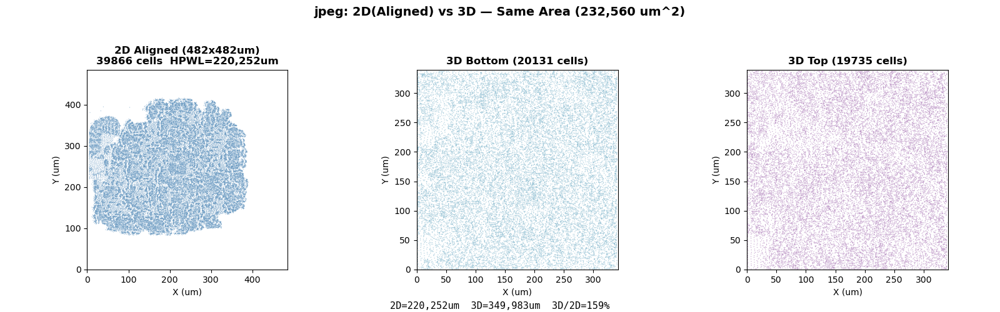

# jpeg 实验数据

**设计**: jpeg_encoder（39,866 实例，48,436 网线，47 IO），NanGate45 同质双裸片堆叠。

## 实验条件（面积对齐）

| | 2D | 3D |
|---|---|---|
| 工具 | OpenROAD 26Q1（RePlAce） | heteroplace3d v20260807 |
| Die 面积 | 482×482 µm（232,560 µm²） | 每 Die 342×340 µm（116,092 µm²），总 232,184 µm² |
| 全局利用率 | 35% | 35% |

## HPWL（密度未对齐 ⚠️）

> 2D 单元天然向中心聚集，bbox/die 比例低于 3D。密度对齐前，HPWL 对比不具物理意义。以下数据仅供记录。

| 版本 | Die (µm²) | bbox/die | HPWL |
|---|---|---|---|
| 2D aligned | 232,324 | 55% | 220,252 µm |
| 2D tight | 140,000 | 90% | 237,061 µm |
| 3D (total) | 232,184 | 98% | 349,983 µm |

## 局部密度（20×20 µm bin）

| | 空 bin | P50 | P10–P90 | >50% bin |
|---|---|---|---|---|
| 2D | 0% | 70% | 50%–85% | 92% |
| 3D Bottom | 0% | 72% | 54%–90% | 93% |
| 3D Top | 0% | 71% | 53%–89% | 93% |

## 3D Placement 详情

| 指标 | 值 |
|------|-----|
| 工具 | heteroplace3d v20260807 |
| 耗时 | 198s |
| 层分布 | Die0=19,735（49.4%），Die1=20,178（50.6%） |
| HBT | 11,587 |
| 最终 HPWL | 485,570 µm（placer 内部报告） |

## 2D Placement 详情

| 指标 | 值 |
|------|-----|
| 工具 | OpenROAD 26Q1（RePlAce + ABCDPlace） |
| legalized HPWL | 289,029 µm（placer 内部报告） |

## 待完成

- [x] 同面积 2D baseline
- [ ] 逐网线 2D/3D 对比
- [ ] 逐单元位移分析
- [ ] HBT 溢流分析
- [ ] 模块亲和性分析（FDCT/Zigzag 层级）
