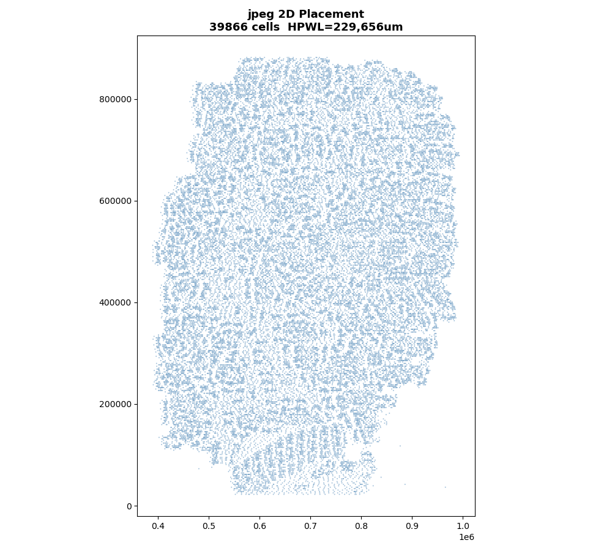
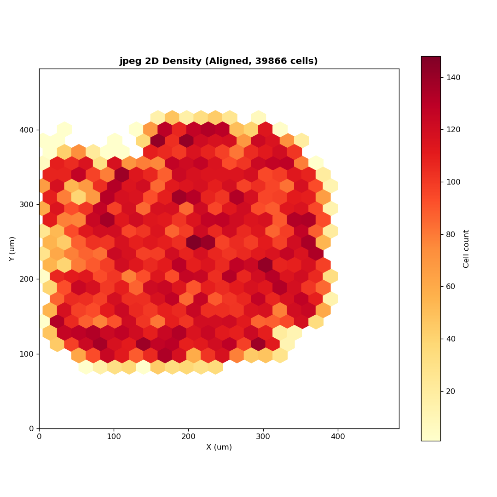
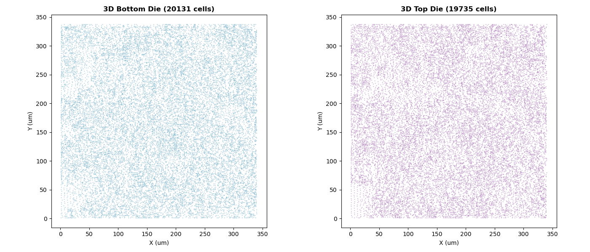
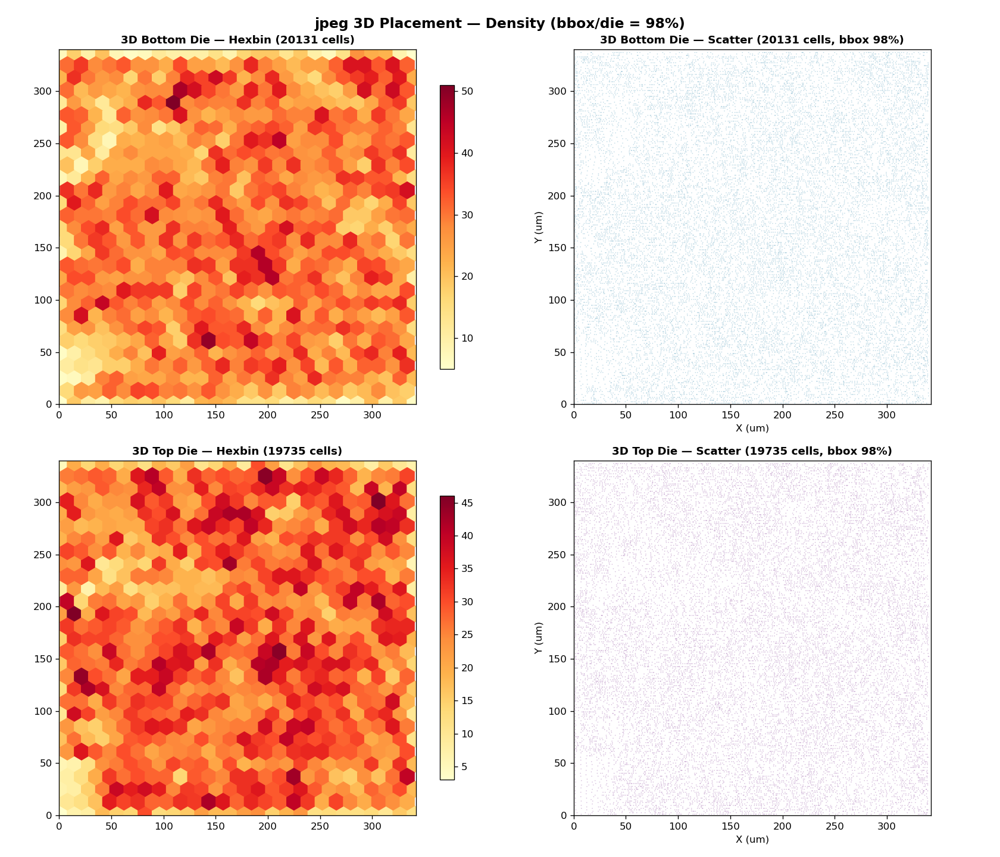

# jpeg 实验数据（未对齐面积）

**设计**: jpeg_encoder（39,866 实例，48,436 网线，47 IO），NanGate45 同质双裸片堆叠。

> ⚠️ 2D 和 3D 的 die 面积未对齐。2D 使用了原始 Innovus floorplan，3D 是 heteroplace3d 的内生 floorplan。数据仅供记录，不做物理结论。

## 实验条件

| | 2D | 3D |
|---|---|---|
| 工具 | OpenROAD 26Q1（RePlAce） | heteroplace3d v20260807 |
| Die 面积 | 482×482 µm（232,560 µm²） | 每 Die 342×340 µm（116,092 µm²），总 232,184 µm² |
| 备注 | 全局利用率 35% | heteroplace3d 内生（全局利用率 35%） |

单元 bounding box 仅占 die 面积的 28%（195–496 µm × 11–441 µm）。底部和右侧大面积空白——原始 Innovus floorplan 将 IO 集中放置于左侧和顶部边缘。

## HPWL（同算法：Verilog+DEF）

## HPWL（面积对齐，同 232,560 µm²）

| | HPWL |
|---|---|
| 2D | 220,252 µm |
| 3D | 349,983 µm |
| 3D/2D | **159%** |

同面积同利用率（35%）下，3D HPWL 比 2D 高 59%。
| | HPWL |
|---|---|
| 2D | 229,656 µm |
| 3D | 349,983 µm |
| 3D/2D | 152% |

**2D die 面积约为 3D 总面积的 2 倍。** 面积未对齐前，HPWL 对比不具物理意义。

## 3D Placement 详情

| 指标 | 值 |
|------|-----|
| 工具 | heteroplace3d v20260807 |
| 耗时 | 198s |
| 节点 | 39,866 movable / 39,913 total |
| 网线 | 48,436 |
| 层分布 | Die0=19,735（49.4%），Die1=20,178（50.6%） |

全局利用率 35.2%（Bottom 35.3%，Top 35.0%），总硅面积 232,560 µm²。

以 20×20 µm bin 统计局部密度：

**2D**（全局利用率 16%）：72% 的 bin 为空。非空 bin 中 P50=75%，78% 的 bin 超 50%。

| | 空 bin | P50 | P10–P90 | >50% bin |
|---|---|---|---|---|
| 2D | 72% | 75% | 15%–91% | 78% |
| 3D Bottom | 0% | 72% | 54%–90% | 93% |
| 3D Top | 0% | 71% | 53%–89% | 93% |

2D 仅 28% 的区域有单元，但这些区域的局部密度与 3D 相近（~72-75%）。3D 的优势是把单元均匀分布到了整个 die。

| HBT | 11,587 |
| 最终 HPWL | 485,570 µm（placer 内部报告） |

## 2D Placement 详情

| 指标 | 值 |
|------|-----|
| 工具 | OpenROAD 26Q1（RePlAce + ABCDPlace） |
| 
| 

## 待完成

- [ ] 同面积 2D baseline（die ~232K µm²）
- [ ] 逐网线 2D/3D 对比
- [ ] 逐单元位移分析
- [ ] HBT 溢流分析
- [ ] 模块亲和性分析（FDCT/Zigzag 层级）
