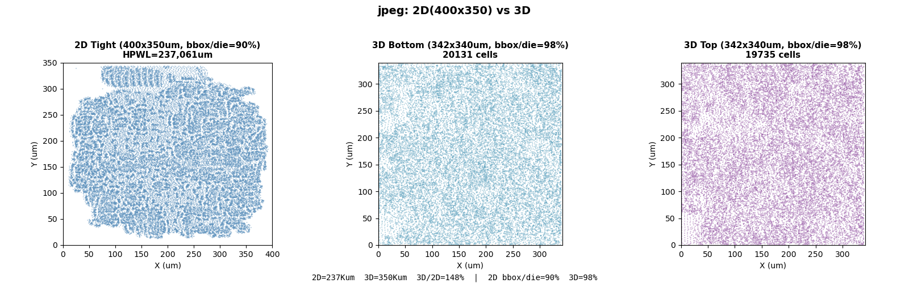

# jpeg 实验数据（进行中）

**设计**: jpeg_encoder（39,866 实例，48,436 网线，47 IO），NanGate45 同质双裸片堆叠。

> ⚠️ 暂停。2D 和 3D 使用不同引擎（OpenROAD vs heteroplace3d），密度对齐尝试多次失败。在同一个引擎上跑通 2D 和 3D 之前，对比不具物理意义。当前数据仅供记录。待合作方提供同引擎的 2D+3D 能力后继续。

## 当前可用的 placement 结果

| 版本 | Die (µm²) | bbox/die | HPWL | 状态 |
|---|---|---|---|---|
| 3D（heteroplace3d） | 每 Die 342×340 µm，总 232,184 | 98% | 349,983 µm | 可用 |
| 2D aligned（OpenROAD） | 482×482 µm，232,324 | 55% | 220,252 µm | 空白太多 |
| 2D tight（OpenROAD） | 400×350 µm，140,000 | 90% | 237,061 µm | 面积不对等 |

## 密度对齐的尝试与问题

- `-density 0.7`：无效，单元分布不变
- `-routability_driven`：GRT-0701 报错，无 track 结构
- 缩 3D die（265×265）：单元溢出（bbox 162%），placer 不把 DIEAREA 当硬约束
- 缩 2D die 到 bbox（tight 版）：有效，但面积与 3D 不对等

## 3D Placement 详情

| 指标 | 值 |
|------|-----|
| 工具 | heteroplace3d v20260807 |
| 耗时 | 198s |
| Die | 每 Die 342×340 µm（116,092 µm²），总 232,184 µm² |
| 层分布 | Die0=19,735，Die1=20,178 |
| HBT | 11,587 |
| 局部密度（20µm bin） | P50=72%，0% 空 bin |

## 2D Placement 详情

| 指标 | 值 |
|------|-----|
| 工具 | OpenROAD 26Q1（RePlAce + ABCDPlace） |

## 待完成

- [ ] 密度对齐
- [ ] 逐网线 2D/3D 对比
- [ ] 逐单元位移分析
- [ ] HBT 溢流分析
- [ ] 模块亲和性（FDCT/Zigzag）
