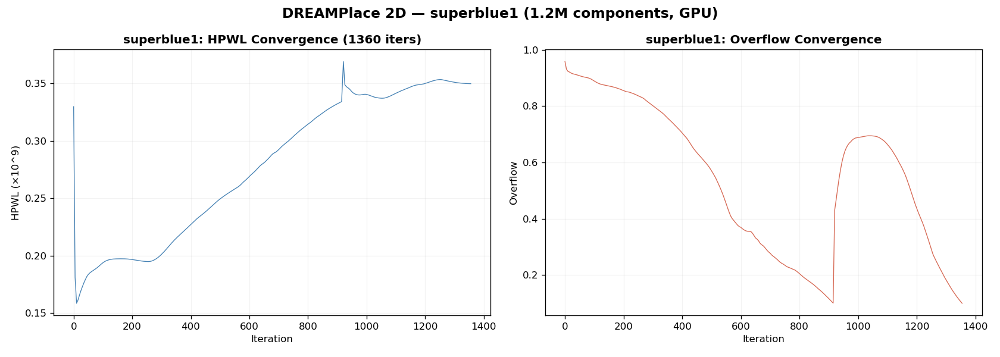

# superblue1：DREAMPlace 2D 验证

**目的**：验证 DREAMPlace 2D（Python 版, v20260809）的 LEF/DEF 流程是否可用。

**设计**: superblue1（ICCAD 2015 benchmark），1.2M 组件，6,528 IO。

## 实验条件

| 参数 | 值 |
|------|-----|
| 工具 | DREAMPlace 2D v20260809（Python + GPU） |
| GPU | NVIDIA TITAN RTX 24GB |
| 输入 | superblue1.lef + superblue1.def + superblue1.v |
| 迭代次数 | 1360（自动收敛） |
| 目标密度 | 1.0 |
| 时序优化 | 关闭（HeteroSTA license 未配置） |

## 结果

| 指标 | 值 |
|------|-----|
| 读入耗时 | 35s |
| 全局布局耗时 | ~50s |
| 最终 GP HPWL | 3.80e8 |
| 细节布局 | 未运行（ntuplace3 引擎未包含） |

## 结论

LEF/DEF 输入路径完全正常。1.2M 组件的工业级 benchmark 在 90s 内完成全局布局。

当前限制：Verilog bus 语法不支持（影响 gcd），细节布局引擎缺失（不影响 HPWL 对比）。两者均可在后续版本修复。
